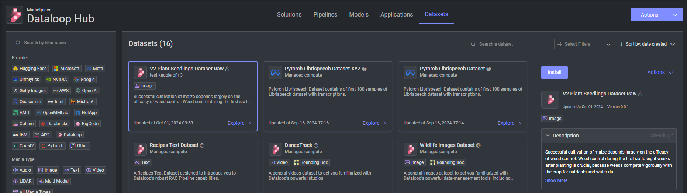

# Dataset adapter for [Kaggle] V2 Plant Seedlings Dataset Raw

This dataset adapter is designed to facilitate the transformation of the [V2 Plant Seedlings Dataset](https://www.kaggle.com/datasets/vbookshelf/v2-plant-seedlings-dataset) 
dataset from zip into a format compatible with Dataloop platform (**WITHOUT** Annotations).\
The adapter simplifies the process of importing and preparing the dataset for various deep learning tasks.

## Installation

1. Navigate to **Marketplace**.
2. Select **Datasets**.
3. Click on **Install**.
4. After a while, a new dataset will be created and visible under your **Data** section.
